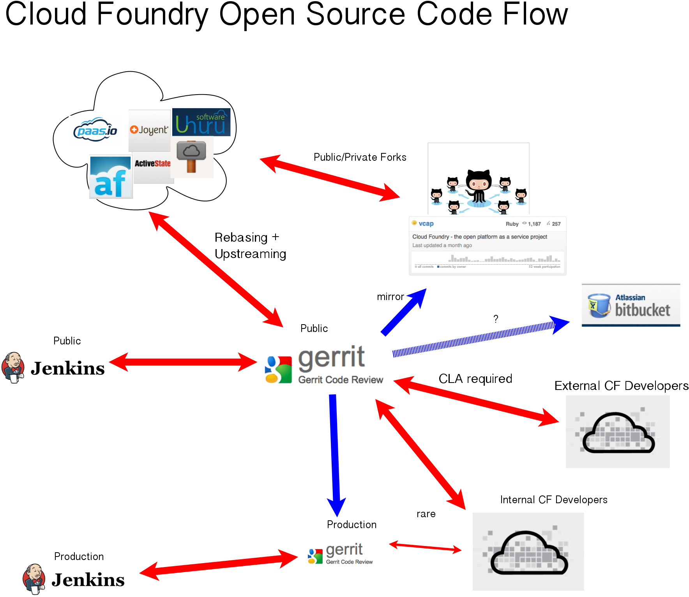

\thispagestyle{empty}
\changepage{}{}{}{-1.5cm}{}{2cm}{}{}{}
\

\clearpage
\changepage{}{}{}{1.5cm}{}{-2cm}{}{}{}

## About This Book

### License

The Little Cloud Foundry Book book is licensed under the
Attribution-NonCommercial-Share-Alike 3.0 Unported license. **You should not
have paid for this book.**

You are basically free to copy, distribute, modify or display the book.
However, you must attribute the book to Leto Labs LLC and do not use it for
commercial purposes. If you would like to use the content of this book
under a different license feel free to contact duke@leto.net .

You can see the full text of the license at:

<http://creativecommons.org/licenses/by-nc-sa/3.0/legalcode>

### About The Author

Jonathan "Duke" Leto, Founder
Leto Labs LLC

### Thanks, Yall

...

### Latest Version

The latest source of this book is available at:

<http://github.com/letolabs/the-little-cloud-foundry-book>.

\clearpage

## Introduction

 > Graecum est; non legitur -- "It's Greek to me"

### What is a Platform-As-A-Service (PAAS)?

A PAAS is middleware between the low-level infrastructure (i.e. the actual
CPUs, hard-drives, RAM, etc) and the high-level applications that run on top
of the platform. The boundary between the platform and the application is
clear, but the boundary between the infrastructure and the platform is
still in flux and in active development.

## What is Cloud Foundry?

Cloud Foundry consists of a large amount of Ruby code along with a small amount
of C and Shell scripts that run on top of Ubuntu LTS. The C code is used to 
manage Linux containers at the kernel level using a similar strategy as the
Linux kernel user space program "lxc". CF also consists of many configuration
files in YAML format.

## Features

Current languages supported: Ruby, Java, NodeJS, PHP

Frameworks supported: Rails, Spring, etc..

Python and Perl supported in forks but not yet upstreamed.

## Glosssary

### ACM

### caldecott

### cloud controller

### Chef

### DEA

### dev-ops

### droplet

### Gerrit

### IAAS

### health

### health manager

### lxc

### PAAS

### stager

### Ubuntu LTS

### UUA

Long-term supported releases of Ubuntu are supported for 2 years by Canonical.

### vmc

### warden

## Community

How does one get involved with Cloud Foundry? That is currently unclear. The
community is eagerly awaiting a public Gerrit instance so that developers at
VMware can work in the open along with outside developers. Many Github pull
requests have been submitted, but most have not been dealt with. This is
partly explained by the fact that it was VMware's practice to sync to their
public Github mirror roughly monthly which greatly increases the likelihood
of merge conflicts.

Public gerrit, waiting until...

TODO: Insert community diagram.

There is an "unofficial" cloudfoundry IRC channel on Freenode at #cloudfoundry.

## History of Cloud Foundry

## Case Studies

### ql.io

node.js grumbles

### IRC interview #1

???

### NTT

Contributed memcached pull request on Github, has large internal CF cloud.

## Links

http://cloudfoundry.org

https://github.com/cloudfoundry
